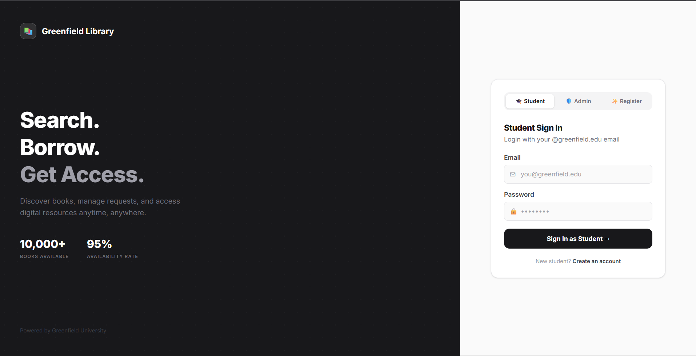
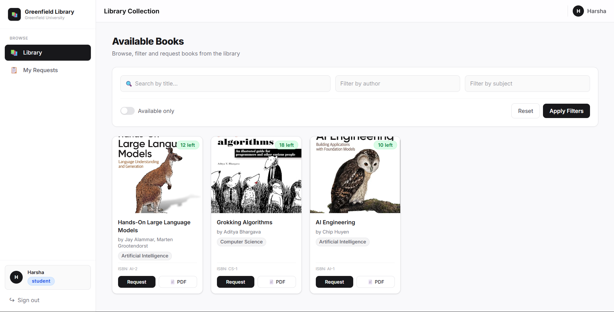
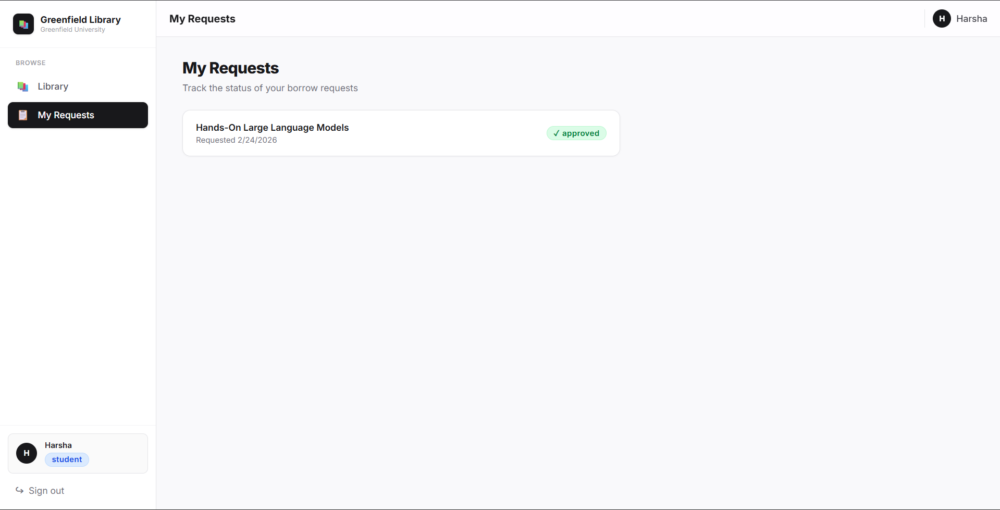
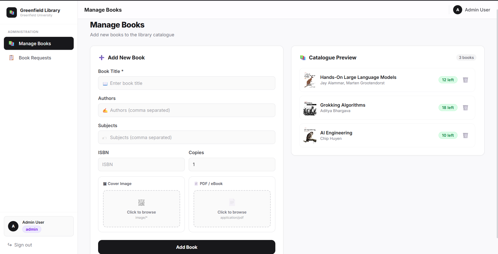
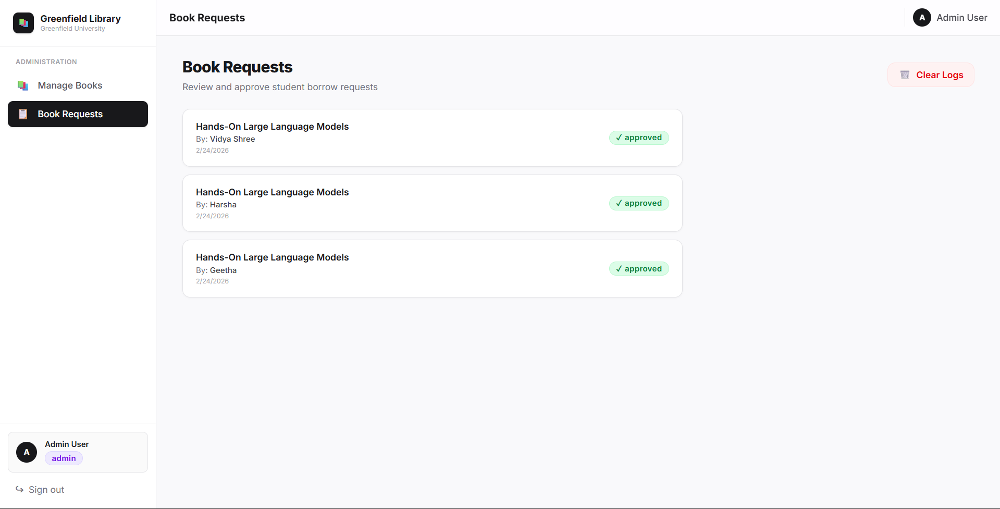

# Greenfield University Instant Library 📚

A comprehensive, cloud-enabled library management system built for Greenfield University. This application provides dual portals—one for students to seamlessly browse the library collection, request books, and access digital resources, and another for administrators to manage the library's catalog and review student requests.

---

###   Live Demo
**[Instant Library Platform](https://instant-library-frontend.vercel.app/)**

---

## 📸 Screenshots

### 1. Student / Admin Login & Registration


### 2. Student Dashboard - Library Collection


### 3. Student - Book Requests Log


### 4. Admin Dashboard - Manage Books


### 5. Admin - Book Requests Log


---

##  🌟 Key Features

### Student Portal
- **Authentication**: Secure Login and Registration using a Greenfield University email address.
- **Library Collection**: Browse a vast catalog of available physical and digital books.
- **Search & Filtering**: Search titles directly, or filter the collection by authors and subjects.
- **Borrowing & Access**: Request physical copies or instantly access PDF versions of materials.
- **Request Tracking**: Real-time status tracking for all book borrow requests (Pending, Approved, Rejected).

### Admin Portal
- **Secure Access**: Dedicated administrator login.
- **Catalog Management**: Add new books to the library, upload cover images, and attach digital PDF/eBooks.
- **Request Moderation**: Review all student borrow requests and log actions by approving or clearing them.
- **Real-time Previews**: Instantly view the available copies, live catalog previews, and system metrics.

---

## ☁️ Cloud Architecture & Technologies

Greenfield Library is a fully robust, cloud-enabled application leveraging modern AWS services to ensure high availability, scalability, and performance:

- **Frontend**: React (Vite) offering a fast, responsive, and aesthetically premium dark-mode interface.
- **Backend & API**: Python (Flask), providing secure and efficient REST endpoints for the frontend, with JWT authentication and boto3 for AWS integrations.
- **Amazon S3**: Used for robust object storage. Hosts high-quality book cover images and serves digital PDF access securely via presigned URLs.
- **Amazon DynamoDB**: A highly scalable NoSQL database utilized for storing book metadata, user accounts, and real-time transaction logs of borrow requests.
- **Amazon EC2**: The Flask production backend server (served by Gunicorn) is hosted on reliable EC2 instances, ensuring low latency and consistent uptime.
- **Amazon SNS (Simple Notification Service)**: (Integrated) Used to asynchronously trigger event-driven notifications—such as instant updates to students when their book requests are approved.

---

## 🚀 Getting Started

### Prerequisites
- Node.js (v18 or higher) for the frontend
- Python (3.10 or higher) for the backend
- AWS Account with corresponding credentials configured (`AWS_ACCESS_KEY_ID`, `AWS_SECRET_ACCESS_KEY`, `AWS_REGION`).

### Installation

1. **Clone the repository:**
   ```bash
   git clone https://github.com/Harshabarik2005/greenfield_university.git
   cd greenfield_university
   ```

2. **Frontend Setup:**
   ```bash
   cd instant-library-frontend
   npm install
   # Configure your .env file
   npm run dev
   ```

3. **Backend Setup:**
   ```bash
   cd ../instant-library-backend
   python -m venv .venv
   source .venv/bin/activate   # Windows: .venv\Scripts\activate
   pip install -r requirements.txt
   # Configure your .env file with AWS Credentials, DB configuration, etc.
   python app.py
   ```

   For production (e.g. on EC2), run it with Gunicorn:
   ```bash
   gunicorn -w 1 --threads 4 -b 0.0.0.0:4000 app:app
   ```

## 📄 License
This project is licensed under the MIT License.
